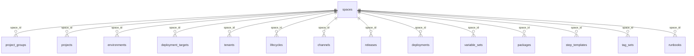
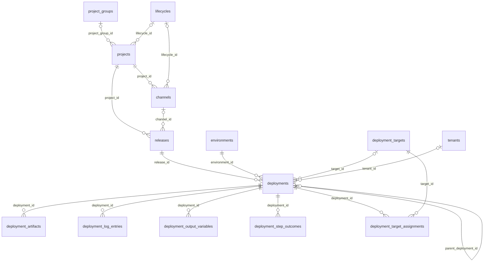
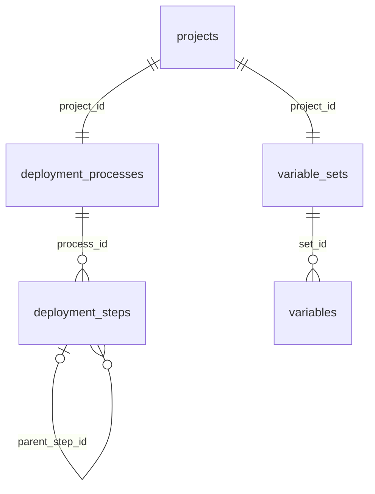
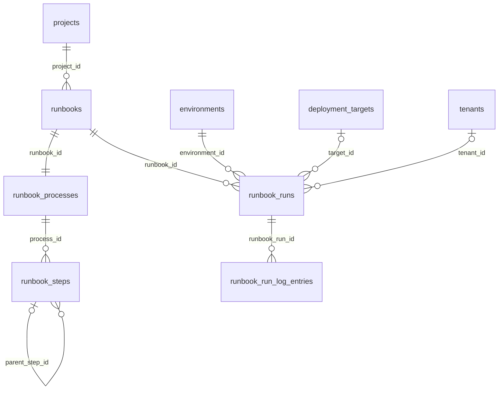
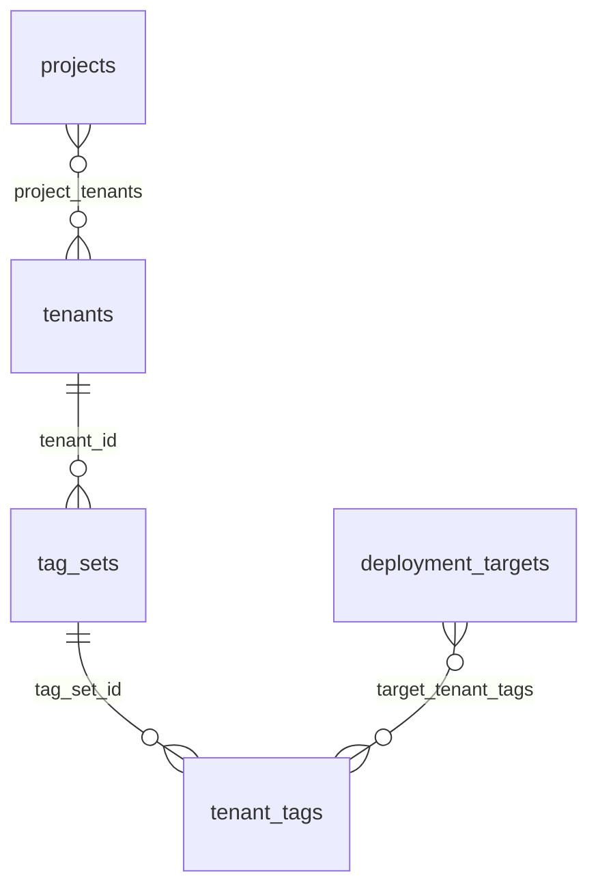
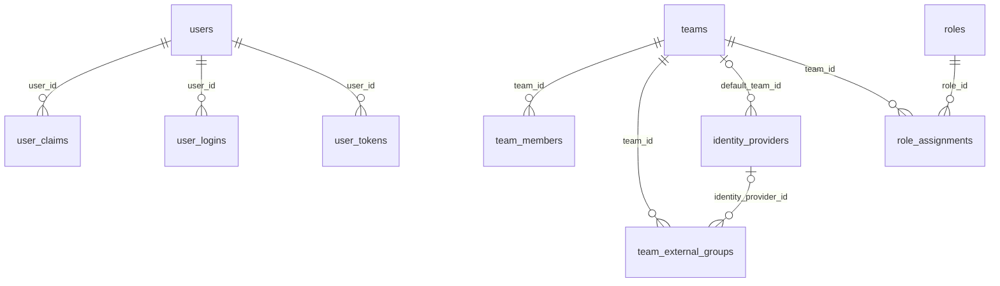
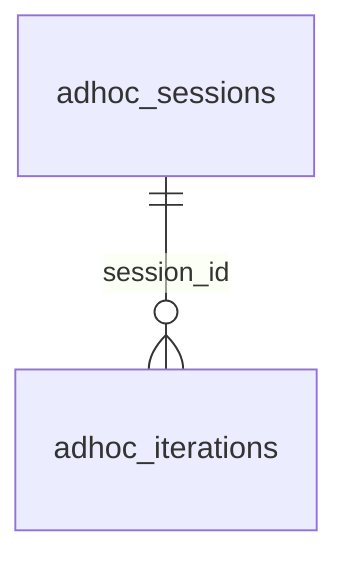

# KrakenDeploy — Database ER Diagram

| | |
|---|---|
| **Status** | Approved |
| **Version** | 1.0 |
| **Last updated** | 2026-05-29 |
| **Applies to** | `KrakenDbContext` (PostgreSQL, snake_case), ~61 tables |
| **Source of truth** | `src/KrakenDeploy.Server.Data/Migrations/KrakenDbContextModelSnapshot.cs` |

Visual ER diagram derived from the EF Core model snapshot. Diagrams are split by
subsystem for readability; together they cover all 61 foreign keys. Mermaid
renders inline on GitHub and in VS Code (Markdown Preview Mermaid Support).

## Conventions

- **Cardinality:** `||--o{` = required parent → many children (FK `NOT NULL`);
  `|o--o{` = optional parent → many children (FK nullable, `ON DELETE SET NULL`);
  `||--||` = one-to-one; `}o--o{` = many-to-many via a join table.
- **Edge label** = the FK column (or the join table, for m2m).
- **Space scoping:** Many tables carry a `space_id` filter column WITHOUT a
  DB-level FK to `spaces` (the EF global query filter enforces isolation, not a
  constraint). Only the tables with an actual FK are drawn against `spaces` in
  Diagram 1. The filter-only tables are listed under §8.
- Columns/types/indexes are not shown here — generate full DDL with
  `dotnet ef migrations script --idempotent` (see §9).

## 1. Space-scoped aggregate roots

Tables that have a real FK to `spaces` (cascade is `RESTRICT` — a Space can't be
deleted while it owns objects).



## 2. Project, release & deployment domain



## 3. Deployment process & variables



## 4. Runbooks



## 5. Tenants & tags



## 6. Identity, teams & RBAC (M10)



> `team_members.user_id` and `role_assignments` scope columns
> (`space_id`/`project_id`/`environment_id`/`tenant_id`) are stored without FK
> constraints — they're resolved by the permission evaluator, not the DB.

## 7. AI (M11)



The other AI tables — `space_ai_settings` (one row per Space),
`ai_call_logs`, `deployment_diagnoses` — and `adhoc_sessions` itself are
Space-scoped by the `space_id` filter column only (no FK; see §8).

## 8. Space-scoped (filter-only) & standalone/config tables

No outbound FK in the model; `space_id` (where present) is a query-filter column,
not a constraint.

- **Space-scoped (filter only):** `adhoc_sessions`, `space_ai_settings`,
  `ai_call_logs`, `deployment_diagnoses`, `audit_entries`, `deployment_freezes`,
  `event_subscriptions`, `backup_runs`.
- **Server-level config / singletons:** `maintenance_settings`,
  `performance_settings`, `smtp_settings`, `backup_settings`, `feature_flags`.
- **Catalog / queue / delivery:** `step_packages`, `step_package_catalog`,
  `step_template_catalog`, `email_digest_outbox`, `subscription_deliveries`,
  `subscription_poller_state`.

## 9. Regenerate full DDL

```powershell
dotnet ef migrations script --idempotent `
  --project src/KrakenDeploy.Server.Data `
  --startup-project src/KrakenDeploy.Server.Data `
  --output docs/schema.sql
```

## References

- `src/KrakenDeploy.Server.Data/Migrations/KrakenDbContextModelSnapshot.cs` — authoritative model
- `src/KrakenDeploy.Server.Data/Configurations/*.cs` — per-entity EF configuration
- `docs/adhoc-actions.md` — the AI ad-hoc subsystem (M11.E)
